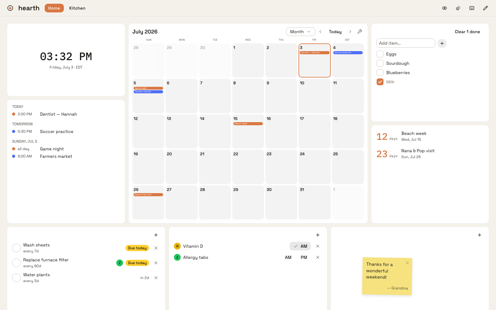

<h1 align="center">
  <picture>
    <source media="(prefers-color-scheme: dark)" srcset="docs/lockup-dark.png">
    
  </picture>
</h1>

<p align="center"><em>The quiet fire at the center of your home.</em></p>

<p align="center">
  <a href="https://github.com/zandoh/hearth/actions/workflows/ci.yml"></a>
  <a href="https://github.com/zandoh/hearth/releases"></a>
  <a href="LICENSE"></a>
</p>

A self-hosted home hub for an always-on touchscreen: a widget grid the whole
household shares — calendar (with Google sync), chores, groceries, weather,
medications — with drag-to-arrange layouts saved as named views.

<picture>
  <source media="(prefers-color-scheme: dark)" srcset="docs/board-dark.png">
  
</picture>

Ships as a **single Go binary** with the web app embedded. The web UI is the
first client of an API-first backend; a future mobile app talks to the same
API.

## Stack

- **Backend**: Go, standard library first — `net/http` routing, SSE for
  realtime (no WebSocket dependency), SQLite via `modernc.org/sqlite`
  (pure Go, no CGo).
- **Frontend**: React + Vite + [Astryx](https://astryx.atmeta.com/) design
  system, `react-grid-layout` for the drag-to-arrange grid. Tooling runs on
  **bun**, linted with **oxlint**, formatted with **oxfmt**.

## Quick start

**Docker (recommended for a home server):**

```sh
mkdir hearth && cd hearth
curl -O https://raw.githubusercontent.com/zandoh/hearth/main/compose.yml
docker compose up -d     # board on http://localhost:8080
```

State lives in `./data/` (SQLite + optional `.env`); back it up by copying
the folder. Images are multi-arch (amd64 + arm64) at `ghcr.io/zandoh/hearth`.

**Prebuilt binary:** grab your platform's tarball from
[Releases](https://github.com/zandoh/hearth/releases), unpack, `./hearth`.

**From source:**

```sh
make build   # builds web/ with bun, embeds it, produces bin/hearth
./bin/hearth # serves everything on :8080, creates hearth.db
```

Flags: `-addr :8080`, `-db hearth.db`.

### Hosting at a friendly name (e.g. hearth.local)

Hearth binds any hostname — point DNS/mDNS at the box and it works. On a
Mac mini host the easiest route is System Settings → General → Sharing →
Local hostname → "hearth", which advertises `hearth.local` over Bonjour
(Apple devices and most modern platforms resolve it; some Android versions
don't — a hostname entry in your router's DNS covers everything).

One caveat: Google's OAuth console only accepts plain-http redirect URIs
for `localhost`. If `HEARTH_BASE_URL` is `http://hearth.local:8080`, do the
one-time Google connect through a localhost tunnel instead:
`ssh -L 8080:localhost:8080 you@hearth.local`, then connect at
`http://localhost:8080` with `HEARTH_BASE_URL` unset. Day-to-day use at
`hearth.local` is unaffected — only the consent redirect cares.

## Development

Two terminals, then browse **http://localhost:5173**:

```sh
make dev-api   # Go API on :8080, auto-rebuilds + restarts on .go/.sql changes
make dev-web   # Vite dev server on :5173 with HMR, proxies /api to :8080
```

React edits hot-swap in place (state preserved). Go edits trigger a rebuild
and restart in about a second (`fswatch` required: `brew install fswatch`;
without it, `make dev-api` falls back to a plain run and you restart by hand).
App state survives restarts because it lives in SQLite, not the process — and
the browser's SSE connection reconnects automatically. `make dev-api-once`
runs the server without the watcher.

Checks:

```sh
make test   # go test
make lint   # go vet + staticcheck + oxlint + oxfmt --check
make fmt    # gofmt + oxfmt
```

## Architecture

Everything is a **widget** conforming to one contract, wired in exactly two
places:

- **Server** (`internal/widgets/<name>/`): implements `widget.Widget` —
  `ID()`, `Routes(mux)` for its API under `/api/widgets/<id>/`, and `Jobs()`
  for recurring background work (sync, refresh). Registered once in
  `cmd/hearth/main.go`.
- **Client** (`web/src/widgets/`): a React component registered in
  `web/src/widgets/registry.ts` under the same slug.

Widgets publish realtime updates through the SSE hub (`internal/sse`); the
frontend holds one `EventSource` on `/api/stream` and components subscribe to
topics with `useTopic`.

**Views** are named grid layouts (`views` table): a JSON array of
`{i, widget, x, y, w, h, config}`. The Edit button on the kiosk toggles
drag/resize; Save writes the layout back via `PUT /api/views/{id}`.

The clock widget (`internal/widgets/clock`, `web/src/widgets/ClockWidget.tsx`)
is the reference implementation of the whole contract.

### Layout

```
cmd/hearth/          entrypoint: flags, wiring, graceful shutdown
internal/server/     HTTP API assembly + embedded SPA serving
internal/store/      SQLite: migrations (embedded .sql) + all queries
internal/sse/        Server-Sent Events hub
internal/widget/     widget contract + registry + job scheduler
internal/widgets/    one package per widget
web/                 Vite + React + Astryx app (bun)
web/embed.go         go:embed of web/dist into the binary
```

## Google Calendar setup (optional, one-time)

Hearth syncs any number of Google Calendars (a shared family calendar, each
person's own, etc.). Because Hearth is self-hosted, you bring your own Google
OAuth credentials — they stay on your server and are **never committed**:

1. Create a project at [console.cloud.google.com](https://console.cloud.google.com)
   and enable the **Google Calendar API**.
2. Configure the OAuth consent screen (External, add your household's Google
   accounts as test users — no verification needed for personal use).
3. Create an **OAuth client ID** of type **Web application** with redirect URI
   `http://localhost:8080/api/widgets/calendar/google/callback`
   (replace host/port with wherever Hearth runs; set `HEARTH_BASE_URL` to match).
4. Copy `.env.example` to `.env` next to the binary and fill in the
   credentials — Hearth loads it on start (real environment variables
   override the file, and `.env` is gitignored):

```sh
cp .env.example .env
# edit .env, then:
./bin/hearth
```

Then open the calendar widget's ⚙ settings → **Connect Google account**, and
add whichever calendars the household wants on the board. Events sync every
5 minutes (plus instantly on "Sync now"); events added in Hearth are written
straight to Google.

## Roadmap

Phase 1: calendar (+ Google Calendar sync), chores, grocery list, weather,
medications. Phase 2: maintenance reminders, profiles, kiosk polish (night
dimming, photo screensaver). Phase 3: utilities trends, notifications, mobile
(PWA).
